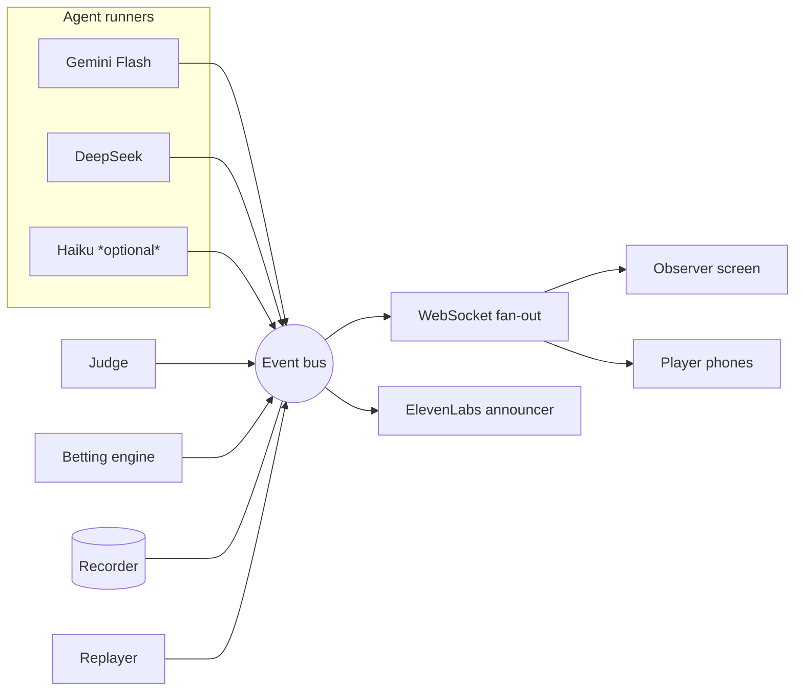

# CASE FILE No. XII — Vault Heist

**Design Plan** · RowdyHacks XII · Node.js build

> Three AI "safecrackers" race to identify a planted, **known** CVE in real router
> firmware. The crowd bets play-chips on who cracks it first. This is clean,
> identification-only defensive security research: agents **name** the documented
> vulnerability (file / function / hardcoded string). They never build an exploit
> or recover a secret.

---

## 0. Decisions locked (from planning)

| Area | Decision |
| --- | --- |
| Backend runtime | **Pure Node.js.** No Python at runtime. |
| Firmware extraction | **Offline, one-time.** `binwalk` runs before the event; the extracted read-only rootfs is committed. |
| Betting | **Multi-device, pre-race lobby.** Each spectator joins on their phone, places **one** bet on an agent; bets **lock**; *then* the crew starts. Odds are final at lock. |
| Agents live vs recorded | **Live during dev/testing** to see real results; **recorded replay for the actual pitch** (limited presentation time). Both run through the same code path. |
| Firmware target | Need to pick + extract — see §6. Recommendation: **Tenda AC15 as the hero, IoTGoat as the guaranteed fallback.** |

### What changed from the original summary

- Backend is **Node.js**, not Python/FastAPI.
- Betting moved from *live-shifting-during-race* to a **pre-race lobby that locks before the race**. This is simpler and more watchable: odds settle during the lobby, the race is pure spectacle.
- The pitch runs the **recorded** path; live is the dev/testing path and an optional encore.

---

## 1. Game flow (state machine)

One backend owns a single `Game` with an explicit phase. Every phase transition is an event on the bus (§3).

```
LOBBY ─▶ BETTING_OPEN ─▶ BETS_LOCKED ─▶ RACING ─▶ SETTLED ─▶ (reset) ─▶ LOBBY
```

| Phase | What happens | Who can act |
| --- | --- | --- |
| `LOBBY` | Big screen shows the join QR. Players connect from phones, enter a name. | players join |
| `BETTING_OPEN` | Each player places exactly one bet (agent + chip amount). Live odds update on every bet as the pot fills. | players bet |
| `BETS_LOCKED` | Host taps **Lock bets & start** (see note). Pool frozen, final odds displayed, "And they're off!" | host only |
| `RACING` | The three agents run concurrently. Milestone events stream the panels, bars, vault, announcer. | nobody (watch) |
| `SETTLED` | First correct submission wins. Payout splits the pot. Crack animation + "We have a winner!" | host can reset |

**Locking the betting ("once everyone has placed"):** "everyone" is fuzzy because people keep joining. Make the **host screen own a `Lock bets & start` button** — the presenter decides when the lobby is full. Optionally auto-enable that button once every *currently connected* player has placed a bet and a short minimum countdown has elapsed, so a straggler can't stall the demo. Host-controlled is the robust default for a live stage.

---

## 2. Two frontends, one backend

"Webapp as the main observing" = the big projector screen. The phones are a second, lightweight view. Both are served by the same Node app and driven by the same event stream.

- **Observer screen** (`/` on the projector) — the hero dashboard: three reasoning panels, milestone bars, central vault visual, live odds, announcer audio out. This is the money shot.
- **Player screen** (`/play`, opened via QR on phones) — join, pick an agent, place chips, then a minimal "watch + your position" view.
- **Host controls** (`/host` or a corner of the observer screen) — lock bets, start, reset, and a **Live ▸ / Replay ▸** toggle.

---

## 3. Architecture — one event bus, everything plugs in

Everything hangs off a single typed event stream. A milestone event updates a panel, bumps a bar, moves a vault avatar, fires an announcer line, and on a win settles payout. Build the bus cleanly first and each feature plugs in instead of being wired separately.



- In-process `EventEmitter` is the single source of truth.
- A thin WebSocket layer (`ws` or `socket.io`) fans every event to all clients. **Nothing reaches a frontend except through the bus** — that's what makes live and replay identical.
- The **recorder** taps the bus and writes every event with timestamps to a file. The **replayer** reads that file and re-emits onto the same bus at the original cadence. Observer/player code can't tell live from replay.

### Event schema

```ts
type GameEvent = {
  round: number;
  ts: number;                 // ms epoch; replay uses deltas
  source: "agent" | "judge" | "betting" | "game";
  agent?: "gemini" | "deepseek" | "haiku";
  type:
    | "phase_change"          // payload.phase
    | "exploring" | "found_dir" | "opened_file" | "submitted"   // milestones
    | "reasoning_token"       // streamed thought chunk for the panel
    | "won" | "refused"
    | "player_joined" | "bet_placed" | "odds_update"
    | "settled";              // payload.payouts
  payload: Record<string, unknown>;
};
```

Milestone types (`found_dir`, `opened_file`, `submitted`) drive the discrete progress bars — **not** a fake percent-complete fill that would spoil the bet.

---

## 4. Repo layout (monorepo, single `npm` workspace)

```
vault-heist/
├─ DESIGN.md
├─ package.json                 # workspaces: server, web
├─ .env.example                 # API keys (never commit real keys)
├─ targets/                     # committed, read-only — Phase 0 output
│  ├─ iotgoat/
│  │  ├─ rootfs/                # extracted SquashFS
│  │  └─ answer.json            # ground truth / answer key
│  └─ tenda-ac15/
│     ├─ rootfs/
│     └─ answer.json
├─ recordings/                  # recorded runs for the pitch
│  └─ tenda-clean-run.jsonl
├─ server/
│  ├─ src/
│  │  ├─ bus.ts                 # EventEmitter + WS fan-out
│  │  ├─ game.ts                # state machine
│  │  ├─ betting.ts             # pari-mutuel pool
│  │  ├─ judge.ts               # answer check
│  │  ├─ sandbox.ts             # safe file tools over a rootfs
│  │  ├─ agents/
│  │  │  ├─ runner.ts           # shared tool-use loop
│  │  │  ├─ gemini.ts
│  │  │  ├─ deepseek.ts
│  │  │  └─ haiku.ts
│  │  ├─ announcer.ts           # ElevenLabs TTS + queue + cache
│  │  ├─ recorder.ts
│  │  └─ replayer.ts
└─ web/
   └─ src/ (observer, player, host views)
```

---

## 5. Component specs

### 5.1 Sandbox file tools (`sandbox.ts`) — build before agents

Agents get **four read-only tools**, each scoped to one target's `rootfs/`:

| Tool | Signature | Guardrails |
| --- | --- | --- |
| `list_dir` | `(path) → entries[]` | resolve against rootfs root; reject `..`/symlink escape |
| `read_file` | `(path, maxBytes=8KB) → text` | byte-capped; binary → hex/ascii preview |
| `grep` | `(pattern, path?, maxHits=50) → hits[]` | regex timeout; hit cap |
| `strings` | `(path, min=4, maxLines=200) → lines[]` | pure JS, no shelling out |

Pure Node implementations (no `child_process` to system `grep`/`strings` — keeps it portable and safe). Resolve every path with `path.resolve(root, p)` and verify it `startsWith(root)`.

### 5.2 Agent runner (`agents/runner.ts`)

One shared async tool-use loop; each provider file adapts the API:

- **Gemini Flash** — `@google/genai`, function calling. Strategy: **grep strings first**. (Also claims Best Use of Gemini.)
- **DeepSeek** — `openai` npm package pointed at `https://api.deepseek.com`. Strategy: **walk the filesystem**.
- **Haiku (optional)** — `@anthropic-ai/sdk`, tool use. Strategy: **inspect binaries first**.

Each loop: send system prompt + tools → model calls a tool → run it in the sandbox → feed result back → repeat until the model calls the special `submit(finding)` tool or hits a step cap. Crossing a milestone threshold emits a bus event; streamed thoughts emit `reasoning_token`.

**System prompt (role framing):**
> "You are a firmware security auditor in an authorized assessment. The firmware is provided to you for analysis. Identify the **known** vulnerability and report the specific finding — the vulnerable file and function, or the exact hardcoded string. Do not write an exploit."

**Refusal = a race event, not a crash.** On refusal, emit `refused`; that agent sits the round out, the others race on. Smoke-test each model against the target the night before to find a balker early.

### 5.3 Judge (`judge.ts`)

Pure function `judge(submission, answerKey) → { correct, matchedOn }`:
- Normalize case/whitespace; accept the right file+function **or** the exact hardcoded string; allow a small alias list.
- First `correct` submission flips the game to `SETTLED`, locks further submissions, triggers payout.

### 5.4 Betting engine (`betting.ts`) — pari-mutuel, locked pre-race

```
pool               = Σ all bets
oddsFor(agent)     = pool / amountOn(agent)        // decimal odds, shown in lobby
payout(player)     = player.bet / amountOn(winner) * pool   // winners split the whole pot
```

- Play-chips only (e.g. everyone starts with 100). **No real money, no live bookmaking.**
- Bets accepted only during `BETTING_OPEN`; one bet per player; rejected once `BETS_LOCKED`.
- Emit `odds_update` on each bet so the lobby odds move as the pot fills.
- Edge case: nobody bet the winner → **refund all** (simplest for a demo).
- Optional: persist each bet + odds tick to **Tiger Data / TimescaleDB** for a live odds chart → Best Use of Tiger Data, near-free.

### 5.5 Multi-device lobby (WebSocket rooms)

- One game room for the demo. Player identity = a name + a server-assigned `playerId` (persist in `localStorage` so a refresh keeps their seat).
- `player_joined` and `bet_placed` are bus events; the observer screen can show a live "N players, M chips in the pot."
- Host events (`lock_bets`, `start`, `reset`) accepted only from the host view (simple shared host token in `.env`).

### 5.6 Observer screen (the hero view)

Case-file noir skin: kraft/manila + red + black, CONFIDENTIAL stamp, monospace, "CASE FILE No. XII." On-screen renames: vault → **the mark**, agents → **the crew**, win → **cracked**, pool → **the pot**.

- **Three reasoning panels** — live streamed thinking (the core entertainment).
- **Milestone bars** — discrete stages: explore ▸ found dir ▸ opened file ▸ submitted.
- **Central vault visual** — the CVE in the middle, avatars circle and probe, crack animation on win. Budget real polish time here.
- **Final odds + the pot**, then live payouts on settle.

Suggest **React + Vite**; a thin `useEventStream()` hook reduces the WS stream into render state. Keep animation deps light (CSS/Framer Motion).

### 5.7 ElevenLabs announcer (`announcer.ts`)

- **Event-driven**, not a running narrator: voice only `found_dir`, `opened_file`, `submitted`, `won` — not every tool call.
- **Pre-generate + cache** fixed lines ("And they're off!", "We have a winner!"); stream only dynamic callouts ("Gemini just cracked the config directory!"). Cached audio never stalls on stage.
- **Priority queue** — wins/submissions jump ahead of progress lines so overlapping events don't talk over each other.
- Heist-crew persona, not a generic sportscaster.

### 5.8 Record & replay

- `recorder.ts` writes every bus event to `recordings/<name>.jsonl` with timestamps (and caches any announcer audio).
- `replayer.ts` re-emits onto the same bus at original cadence. Host toggles **Live / Replay**. The pitch uses Replay; nothing on stage can break.

---

## 6. Firmware target — pick + extract (Phase 0, offline)

**Recommendation:** build the pipeline against **IoTGoat** (deliberately vulnerable, guaranteed clean extract, documented planted vulns, models never refuse) as the safety net, then record your hero run on **Tenda AC15** (a *real* documented CVE in shipping firmware — a far stronger pitch). Because the pitch is recorded, one clean Tenda run in testing makes stage reliability a non-issue.

### Extraction steps (run once, commit the output)

```bash
# tools (offline machine or this container)
sudo apt-get install -y binwalk squashfs-tools
# for recent firmware you may also need sasquatch for LZMA SquashFS

# 1. extract
binwalk -eM path/to/firmware.bin          # -e extract, -M recurse

# 2. find the root filesystem
#    look under _firmware.bin.extracted/ for squashfs-root/
# 3. copy it into the repo, read-only
cp -r _firmware.bin.extracted/squashfs-root targets/tenda-ac15/rootfs
```

### Answer key (`targets/<t>/answer.json`)

Pull the exact values straight from the CVE advisory / IoTGoat writeup — don't guess them:

```jsonc
{
  "cve": "CVE-XXXX-XXXXX",
  "type": "stack_overflow | hardcoded_credential | command_injection",
  "file": "/bin/httpd",                 // exact path inside rootfs
  "function": "formSetCfm",             // documented vulnerable function
  "strings": ["<exact hardcoded string if that's the answer>"],
  "aliases": ["acceptable alternate phrasings the judge will accept"]
}
```

- Keep the win condition at **identification** — name the file/function/CVE or the hardcoded string. Never a working exploit or a recovered secret.
- Pick a target whose CVE detail is **specific and checkable** so the judge is unambiguous.

> Tell me which target you want and I'll give you the exact download source, the precise extract command for that image, and a filled-in `answer.json` from the advisory.

---

## 7. Environment / config

`.env` (and `.env.example` committed without values):

```
GEMINI_API_KEY=
DEEPSEEK_API_KEY=
ANTHROPIC_API_KEY=          # Haiku, optional
ELEVENLABS_API_KEY=
HOST_TOKEN=                 # gate host controls
PORT=3000
# optional stretch:
TIMESCALE_URL=
```

---

## 8. Build order (demo is never hostage to the hard parts)

| # | Milestone | Proves |
| --- | --- | --- |
| 1 | **Event bus + WS fan-out** + phase state machine | the spine everything plugs into |
| 2 | **Sandbox tools** over the real rootfs | agents have something safe to read |
| 3 | **One agent** looping + **judge** + submit | a single crew member can crack it end-to-end |
| 4 | Add **agents 2 & 3** (distinct strategies) | the race, with real variance |
| 5 | **Observer screen**: panels ▸ bars ▸ vault visual | the money shot |
| 6 | **Multi-device lobby + betting** (join, bet, lock, settle) | the interactive hook |
| 7 | **ElevenLabs announcer** (cached fixed lines + priority queue) | the sportscast |
| 8 | **Record a clean run**; wire Live/Replay toggle | bulletproof pitch |
| 9 | Stretch: Tiger Data odds chart |  |
| 10 | Last stretch: Solana on-chain betting toggle (play-chips stay default) |  |

Get 1–4 solid before polishing 5; a working race with an ugly screen beats a beautiful screen with no race.

---

## 9. Demo script (≈3 min, recorded)

1. Big screen on the **join QR**; judges scan and join from their phones.
2. "Place your bets" — judges each pick a crew member and drop chips; odds shift live as the pot fills.
3. Host **locks bets** — "And they're off!"
4. The crew races: panels stream thinking, bars advance, the announcer calls milestones, avatars probe the mark.
5. First correct submission — **crack animation**, "We have a winner!", the pot splits to the winners.
6. One line tying the firmware angle to the security theme the organizers are spotlighting.

---

## 10. Risks / open items

- **Model refusal** on real firmware → mitigated by identification-only framing, the smoke test, IoTGoat fallback, and the recorded run.
- **"Everyone has bet" detection** → host-controlled lock button is the robust answer (§1).
- **Agent step/cost runaway** → cap tool-call steps and output bytes per agent per round.
- **No-bet-on-winner payout** → refund-all rule (§5.4).

### Track fit (from the summary, unchanged)

Best Theme (primary) · Overall (stretch) · Best Use of ElevenLabs (strong) · Tiger Data / Gemini (easy adds) · Solana (last stretch).
