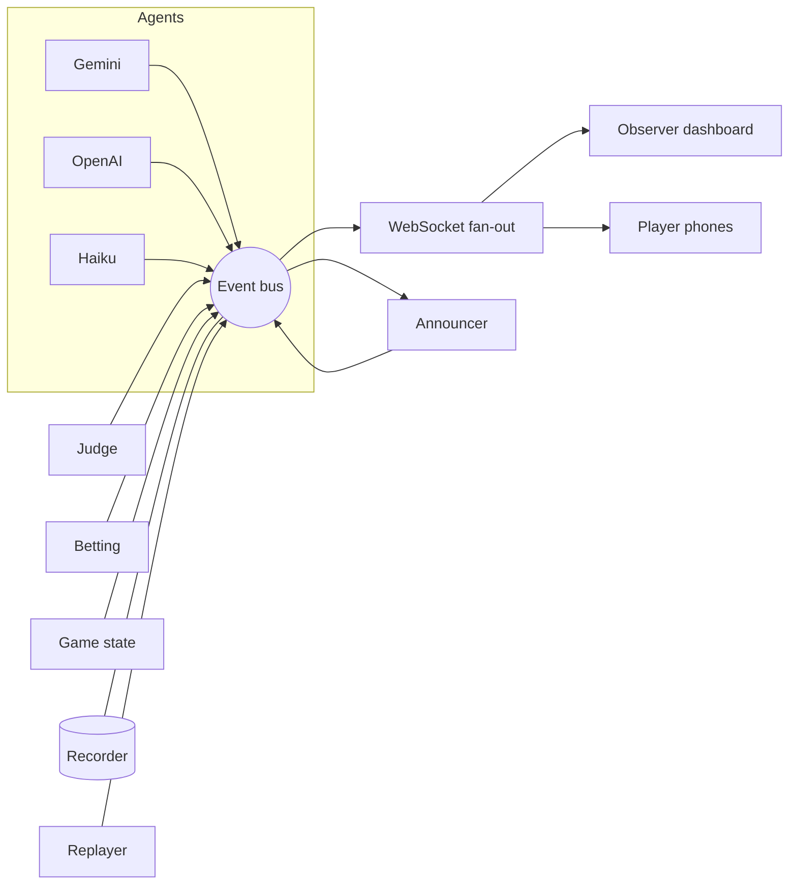

# Rowdy's Security Agents

Three AI "safecrackers" (Gemini, OpenAI and Claude Haiku) race to identify a
planted, **known** vulnerability in real router firmware. The crowd bets
play-chips from their phones on who cracks it first, a vault breaks open on the
win, and a heist-crew announcer calls the race. Built for RowdyHacks XII.

[](https://youtu.be/9adzStKijQI)

**▶ [Watch the demo](https://youtu.be/9adzStKijQI)** · **[Try it live](https://vault-heist-cde6381d1113.herokuapp.com/)** ([player screen](https://vault-heist-cde6381d1113.herokuapp.com/play.html))

> **Identification-only defensive security.** The agents *name* a documented
> vulnerability (file / function / hardcoded string). They never build an exploit
> or recover a live secret. The target is OWASP IoTGoat — firmware published
> specifically for this kind of authorized analysis.

The big-screen dashboard after a race: Gemini cracked it, OpenAI was outpaced
on step 3 of 4, and Haiku used up its three guesses.


The phone player screen, where each player backs a safecracker with chips:


> The screenshots were taken before the rename, so they still say "Vault Heist".

---

## Contents

- [Concept](#concept) · [How a round works](#how-a-round-works) · [Architecture](#architecture) · [Repository layout](#repository-layout)
- [Setup, step by step](#setup-step-by-step) · [Running it](#running-it) · [Demo day](docs/RUNBOOK.md)
- [Testing](#testing) · [Git workflow](#git-workflow) · [Status](#status) · [Troubleshooting](#troubleshooting)

---

## Concept

A live-spectator betting game. Players scan a QR code on the big screen, join on
their phones, and each places **one** bet on an agent. The host **locks**
betting, then the three agents race over a read-only firmware filesystem using
four tools (`list_dir`, `read_file`, `grep`, `strings`), with no shell. The first
to correctly identify the planted vulnerability wins, and the pot is split among
everyone who backed it. Three wrong calls and an agent is out.

The big screen shows:

- **The crew:** each agent's live field notes, typed out as they think, and a
  four-step progress track (Explore → Find dir → Open file → Submit) that shows
  the folder or file the agent reached. Wrong calls get stamped and struck through.
- **The mark:** a vault whose dial spins faster as the crew closes in and whose
  door swings open on the win.
- **The bankroll:** the pot, the bettor count, and the join QR (press **Q** for
  full screen).
- **The announcer:** a broadcast strip with the current call, voiced by
  pre-generated ElevenLabs clips.

On the phone, players stack chips (+25, +50, +100 or ALL IN) onto a rack, back a
safecracker, and see their payout when the case closes.

Everything hangs off a **single event stream**: each milestone updates a panel,
bumps a bar, moves the vault, fires an announcer line, and — on a win — settles
the pot. See [`DESIGN.md`](./DESIGN.md) for the full plan.

## How a round works

A round is a strict progression, driven by the game state machine:

```
LOBBY ─▶ BETTING_OPEN ─▶ BETS_LOCKED ─▶ RACING ─▶ SETTLED ─▶ (new round) ─▶ LOBBY
```

| Phase | What happens |
| --- | --- |
| `LOBBY` | Big screen shows the join QR; players connect from phones. |
| `BETTING_OPEN` | Each player places one bet; odds move live as the pot fills. |
| `BETS_LOCKED` | Host locks betting; odds are final; "and they're off!" |
| `RACING` | The three agents run concurrently; milestones stream. |
| `SETTLED` | First correct submission wins; the pot pays out to its backers. |

## Architecture

One **event bus** is the single source of truth. Agents, the judge, the betting
engine, and the game machine all publish to it; the WebSocket layer fans every
event out to all clients; the announcer and recorder subscribe. Replays re-emit a
recording onto the same bus, so a replay is visually identical to a live run.



Node.js backend (`server/`), static vanilla frontend (`web/`), both pure ESM with
**no build step**. The server-side components are documented in
[`server/README.md`](./server/README.md).

## Repository layout

```
vault-heist/
├─ README.md                 # this guide
├─ DESIGN.md                 # the full design plan
├─ CONTRIBUTING.md           # branch workflow + conventions
├─ docs/
│  ├─ RUNBOOK.md             # demo-day run-of-show
│  ├─ progress.md            # dated dev log
│  └─ *.png                  # screenshots
├─ targets/iotgoat/          # Phase 0 — extracted firmware + verified answer key
│  ├─ rootfs/                #   the read-only filesystem the agents analyze
│  ├─ answer.json            #   ground truth (verified)
│  ├─ extract.sh             #   rebuild rootfs/ from the release image
│  └─ README.md              #   target details
├─ recordings/demo-clean.jsonl  # the vetted race REPLAY plays
├─ server/                   # Node.js backend (npm workspace) — see server/README.md
│  ├─ src/                   #   bus, game, sandbox, betting, recorder, replayer, lan, agents/, announcer/
│  ├─ scripts/               #   record-demo.mjs, generate-announcer.mjs
│  └─ test/                  #   node:test suite
└─ web/                      # dashboard + player screen (static, served by the server)
   ├─ index.html, app.js     #   observer dashboard
   ├─ play.html, play.js     #   phone player screen
   ├─ reducer.js             #   pure render-state reducer (unit-tested)
   ├─ fx.js, qr.js           #   motion helpers, join QR
   ├─ vendor/                #   GSAP, Rough Notation, QR encoder (no CDN at runtime)
   ├─ assets/                #   fonts, icons, artwork
   └─ announcer/             #   pre-generated voice clips + manifest.json
```

---

## Setup, step by step

### Prerequisites

- **Node.js ≥ 22** (`node --version`). Node 24 is fine.
- That's it for the demo — the firmware and announcer voices are committed.

### 1. Clone & install

```bash
git clone https://github.com/RHACKS12/vault-heist.git
cd vault-heist
npm install            # installs the server + web workspaces
```

### 2. Firmware target (Phase 0) — already done

The extracted OWASP IoTGoat rootfs is committed at `targets/iotgoat/rootfs/`
(~13 MB, 1031 files) and the answer key `targets/iotgoat/answer.json` is verified
against it. **You don't need to do anything here to run the demo.**

To rebuild it from scratch (needs internet + `binwalk`/`squashfs-tools`):

```bash
cd targets/iotgoat && ./extract.sh      # downloads the release image, carves the SquashFS rootfs
```

Details and the three vulnerability "rounds" are in
[`targets/iotgoat/README.md`](./targets/iotgoat/README.md).

### 3. (Optional) Agent API keys

Without keys, every agent runs on a **mock provider** (a scripted solver and
wanderers), so the full race still works. For the real models, put keys in a
`.env` file at the repo root (copy `.env.example`):

```
GEMINI_API_KEY=...
OPENAI_API_KEY=...        # ChatGPT crew member (gpt-4o-mini)
ANTHROPIC_API_KEY=...     # Haiku (optional crew member)
```

`.env` is auto-loaded (it's gitignored — never commit it). The provider adapters
in `server/src/agents/providers/{gemini,openai,haiku}.js` are wired to their SDKs.
When you lock betting as host, each agent with a key set runs its real model;
agents without a key fall back to a mock so the race still runs. A shared **$2
per-race cost cap** (`RACE_COST_CAP_USD`) meters real spend. The **AUTO DEMO**
button and replays stay fully mock and keyless.

### 4. (Optional) Announcer voices — already generated

The 17 announcer lines are pre-generated with ElevenLabs and committed under
`web/announcer/` (with `manifest.json`). On startup you'll see
`announcer: 17 pre-generated clips loaded` and the big screen plays them — **no
API calls happen during the event**, so there's zero per-show TTS cost.

To regenerate (e.g. after editing the lines in
`server/src/announcer/catalog.js`), on a machine with internet:

```bash
# put ELEVENLABS_API_KEY + ELEVENLABS_VOICE_ID in .env, then:
cd server
npm run generate:announcer -- --dry-run   # previews the plan + your credit balance, generates nothing
npm run generate:announcer                 # synthesizes the 17 clips + manifest.json
cd .. && git add web/announcer && git commit -m "Regenerate announcer clips" && git push
```

The generator **checks your ElevenLabs balance first and refuses to run if it's
too low**, so it can't overrun your credits (the whole catalog is ~900 chars).
With no clips, the dashboard falls back to the browser's built-in speech.

---

## Running it

### Quick / dev

```bash
npm start        # dashboard at http://localhost:3000/ , player screen at /play.html
npm run demo     # start + walk one scripted phase cycle (just phase events)
npm run race     # start + a full auto demo: bots join, bet, lock, and race
npm run record:demo  # record a fresh clean run into recordings/
npm test         # the full test suite
```

### The full multi-device demo

1. `npm start` on the machine driving the projector. Open `http://localhost:3000/`
   (the **observer dashboard**) on the big screen.
2. Players scan the join QR on the dashboard (press **Q** to show it full
   screen), enter an alias, and **join**. The QR points at this machine's LAN
   address, or at `PUBLIC_URL` if you set one (a tunnel or deployed domain).
3. Press **H** (or the **HOST** tab in the bottom-right corner) to open the host
   desk, which stays off the projected page until you need it. Host clicks
   **OPEN BETTING**. Players pick a safecracker and place chips; the
   odds and pot update live on the big screen.
4. Host clicks **LOCK & START**. Bets freeze, the race runs, milestones stream,
   the announcer calls it, and the vault **cracks** on the win.
5. The pot pays out to the winner's backers; each player sees their result on
   their phone. Host clicks **NEW ROUND** to go again.

> **Which problem each race uses:** `ROUND` in `.env`. Unset (the default) runs
> the answer key's `defaultRound`, `hardcoded-credentials`, every race, which is
> the setup the demo recording proved. A round name (`shellback-backdoor`,
> `command-injection`) pins that problem; `ROUND=random` picks a different one
> each race, after bets lock. Replays always replay their recorded run.

> **Before exposing the server publicly, set `HOST_TOKEN` in `.env`.** It gates
> every control action — open, **lock & start a real race** (which spends API
> money), reset, record, replay, and the demo race — so random visitors can't
> drive the agents. Players can still join and bet freely. The dashboard prompts
> for the token on the first host action and remembers it. Unset = all controls
> open (fine for local dev only). Races are also throttled by `RACE_COOLDOWN_MS`
> (default 8s) and bounded by the `RACE_COST_CAP_USD` ($2) spend cap.

### Replay (the bulletproof demo path)

Click **REPLAY** on the host desk (or `POST /api/replay`). It streams the
committed `recordings/demo-clean.jsonl` through the same bus — identical to a
live run, with **no models and no network**. Use this on stage if WiFi or an API
is flaky. Record your own clean run with `npm run record:demo`.

### Announcer

Click **ANNOUNCER: OFF → ON** on the host desk (browsers need a click before
audio), and again after any page reload. The big screen then plays the
pre-generated voice lines; the **ANNOUNCER** strip always shows the current
call, even when muted.

### Deploying (Heroku)

The live demo runs on Heroku from `main`. Automatic deploys are off, so after
merging, go to the `vault-heist` app → **Deploy** → **Manual deploy** → `main` →
**Deploy Branch**. Heroku runs `npm start` and sets `PORT`; set API keys,
`HOST_TOKEN` and (optionally) `ROUND` under **Settings → Config Vars**.

Open the projector dashboard at the address phones should use: the join QR
encodes the dashboard's own address. On campus, use the `herokuapp.com` address
(see [Troubleshooting](#troubleshooting)).

---

## Testing

```bash
npm test                               # all workspaces (node:test)
npm test --workspace @vault-heist/server
npm test --workspace @vault-heist/web
```

The suite covers the event bus, the game state machine, the firmware sandbox
(against the real rootfs), the agent loop + judge + race, round selection, the
betting math, the recorder/replayer, the announcer, and the dashboard reducer.

## Git workflow

`main` is the trunk; work happens on feature branches and lands through pull
requests (merge commits). Tests must pass before merging. See
[`CONTRIBUTING.md`](./CONTRIBUTING.md).

## Status

| Piece | State |
| --- | --- |
| Phase 0 — firmware extracted + answer key verified | ✅ |
| M1 event bus + state machine · M2 sandbox · M3 agent loop/judge/race | ✅ |
| M4 observer dashboard · M5 multi-device betting · M7 record & replay | ✅ |
| M6 announcer (predefined catalog + **generated ElevenLabs voices**) | ✅ |
| M3b real agent models (Gemini / OpenAI / Haiku) | ✅ set keys in `.env` |
| Join QR, chip stacking, progress track, announcer strip | ✅ |
| `ROUND` setting (pin a problem or randomize per race) | ✅ only `hardcoded-credentials` has been raced with the real models |
| Deployed on Heroku | ✅ manual deploys from `main` |

## Troubleshooting

- **`ELEVENLABS_API_KEY is required` from the generator** → put it in `.env`
  (repo root or `server/`) or pass it inline; `.env` is auto-loaded on Node ≥ 20.12.
- **Generator `403 Host not in allowlist`** → you're on the restricted cloud
  sandbox; run the generator on a machine with normal internet.
- **No announcer audio** → click the **ANNOUNCER** toggle (autoplay needs a
  click, and the toggle resets on reload); check the laptop volume and output
  device. With no `web/announcer/` clips it uses browser speech.
- **The custom domain won't load on UTSA AirRowdy** → campus DNS refuses the
  newly registered domain. Use
  `https://vault-heist-cde6381d1113.herokuapp.com/` on campus, and open the
  projector dashboard there so the join QR points phones at it too.
- **Phones can't open the join link when running locally** → set `PUBLIC_URL`
  in `.env`, or open the dashboard with `?join=http://<your-ip>:3000`.
- **Port in use** → `PORT=4000 npm start`.
- **Firmware missing** → rebuild with `targets/iotgoat/extract.sh` (needs internet).

## Further reading

- [`DESIGN.md`](./DESIGN.md) — the full design plan and rationale.
- [`server/README.md`](./server/README.md) — backend modules, the command API, and the sandbox/agent/announcer internals.
- [`docs/RUNBOOK.md`](./docs/RUNBOOK.md) — the demo-day run-of-show.
- [`docs/progress.md`](./docs/progress.md) — the dated dev log.
