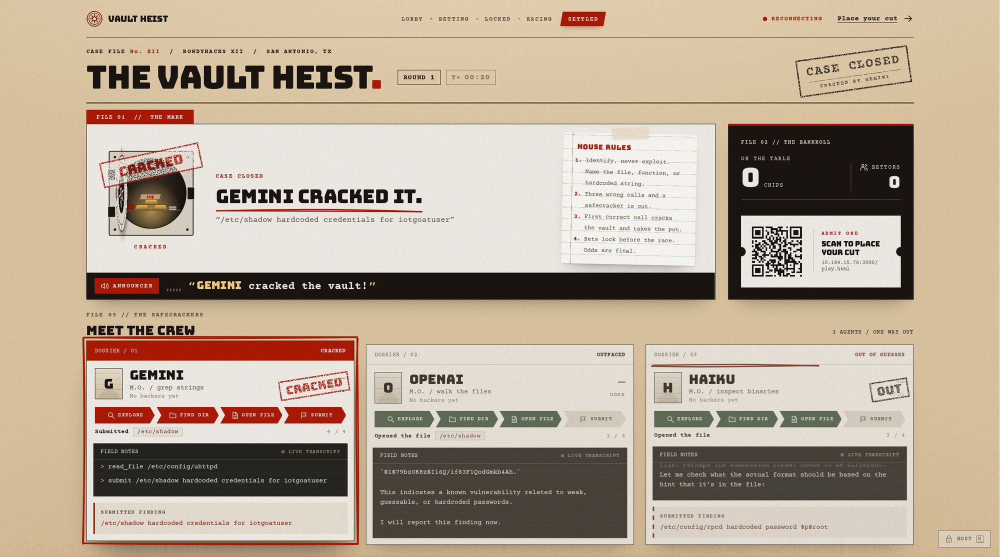
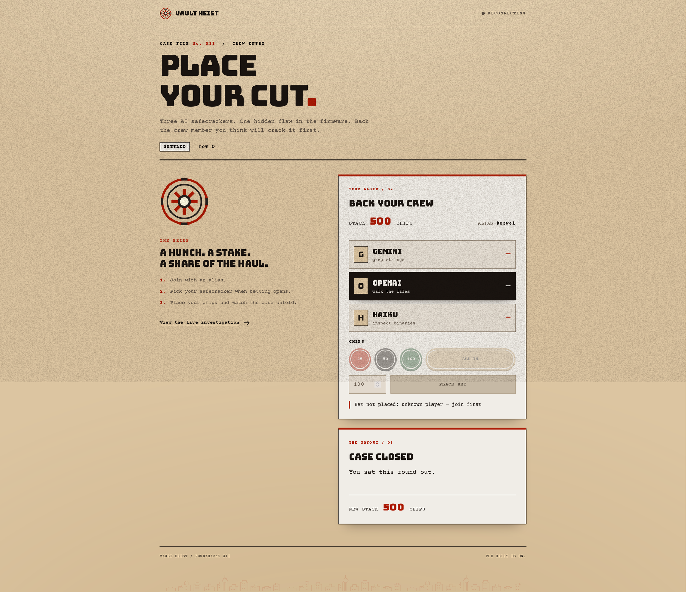

# Rowdy's Security Agents

Three AI "safecrackers" (Gemini, OpenAI and Claude Haiku) race to find a planted,
**known** vulnerability in real router firmware while the crowd bets play-chips
on who cracks it first. Built for RowdyHacks XII.

[](https://youtu.be/9adzStKijQI)

**▶ [Watch the demo](https://youtu.be/9adzStKijQI)** · **[Try it live](https://vault-heist-cde6381d1113.herokuapp.com/)**





> **Identification only.** The agents *name* a documented vulnerability (file,
> function or hardcoded string). They never build an exploit or recover a live
> secret. The target is OWASP IoTGoat, firmware published for exactly this kind
> of authorized analysis.

## How it works

1. Players scan the QR on the big screen and join on their phones.
2. The host opens betting. Each player stacks chips and backs one agent; the odds
   move as the pot fills.
3. The host locks bets and the race starts. Each agent explores a read-only copy
   of the firmware with four tools (`list_dir`, `read_file`, `grep`, `strings`).
4. The big screen streams each agent's reasoning and progress (Explore → Find dir
   → Open file → Submit) while an announcer calls the action. Three wrong calls
   and an agent is out.
5. The first correct finding cracks the vault, and the pot is split among that
   agent's backers.

Everything runs off one event bus: agents, the judge, betting and the game state
publish to it, and the dashboard, phones, announcer and recorder subscribe. That
makes a replay identical to a live race. Node.js backend (`server/`), plain
JavaScript frontend (`web/`), no build step. See [`DESIGN.md`](./DESIGN.md) for
the full design.

## Run it

Needs **Node.js 22+**. The firmware and announcer voices are already committed.

```bash
git clone https://github.com/RHACKS12/vault-heist.git
cd vault-heist
npm install
npm start          # dashboard at http://localhost:3000/, players at /play.html
npm test           # full test suite
```

On the dashboard:

- **H** opens the host desk: OPEN BETTING → LOCK & START → NEW ROUND.
- **Q** shows the join QR full screen.
- **ANNOUNCER: ON** enables audio. Browsers need a click first, and it resets on
  reload.
- **REPLAY** plays the recorded clean race with no models or network, which is
  the safe option on stage. **AUTO DEMO** runs a scripted race.

## Configuration

Put these in `.env` at the repo root (see `.env.example`), or in Heroku's config
vars:

| Variable | What it does |
| --- | --- |
| `GEMINI_API_KEY`, `OPENAI_API_KEY`, `ANTHROPIC_API_KEY` | Real models for LOCK & START. Agents without a key use a scripted stand-in. |
| `HOST_TOKEN` | Locks the host controls. **Set this before going public**: a real race spends API money. |
| `ROUND` | Which problem to race. Unset = `hardcoded-credentials` (the proven demo); a round name pins one; `random` picks a new one each race. |
| `PUBLIC_URL` | The address the join QR uses when the dashboard runs on `localhost`. |
| `RACE_COST_CAP_USD` | Spend cap per race (default $2). |

## Deploying

The live site runs on Heroku from `main`. Automatic deploys are off: after
merging, open the `vault-heist` app → **Deploy** → **Manual deploy** → `main`.

The join QR encodes whatever address the dashboard is open at, so open the
projector dashboard at the address phones should use. On UTSA AirRowdy, the
custom domain doesn't resolve (campus DNS blocks new domains), so use
`https://vault-heist-cde6381d1113.herokuapp.com/`.

## More

- [`docs/RUNBOOK.md`](./docs/RUNBOOK.md): demo-day run-of-show
- [`server/README.md`](./server/README.md): backend modules, API and agent internals
- [`targets/iotgoat/README.md`](./targets/iotgoat/README.md): the firmware and its three vulnerabilities
- [`CONTRIBUTING.md`](./CONTRIBUTING.md): branch and PR workflow
