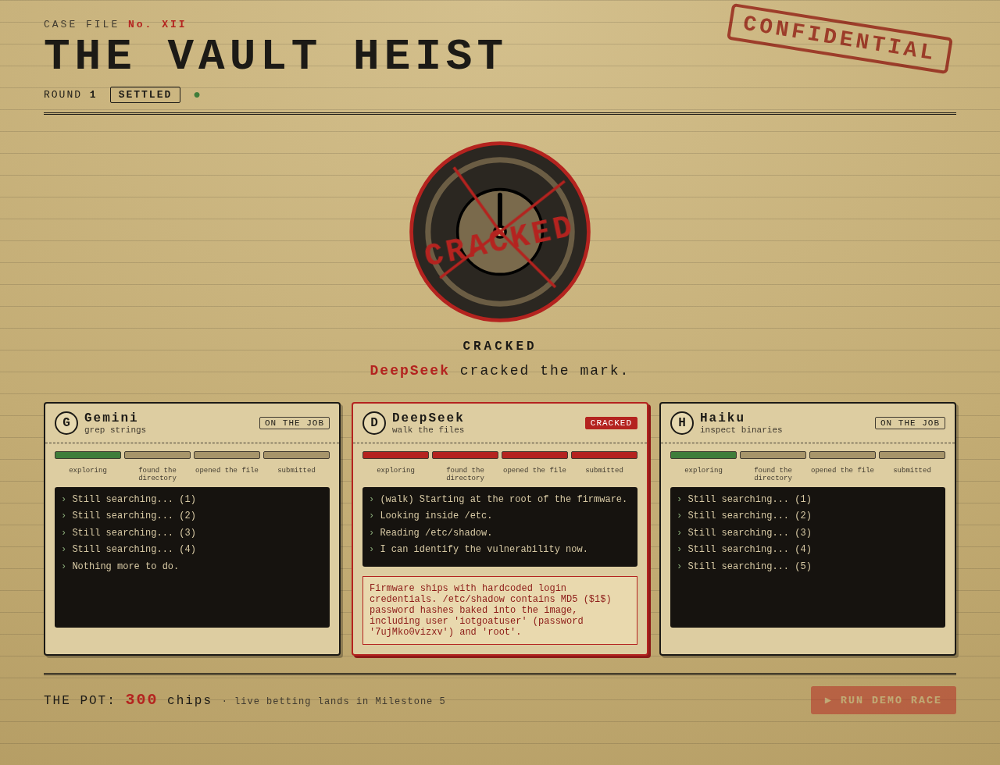
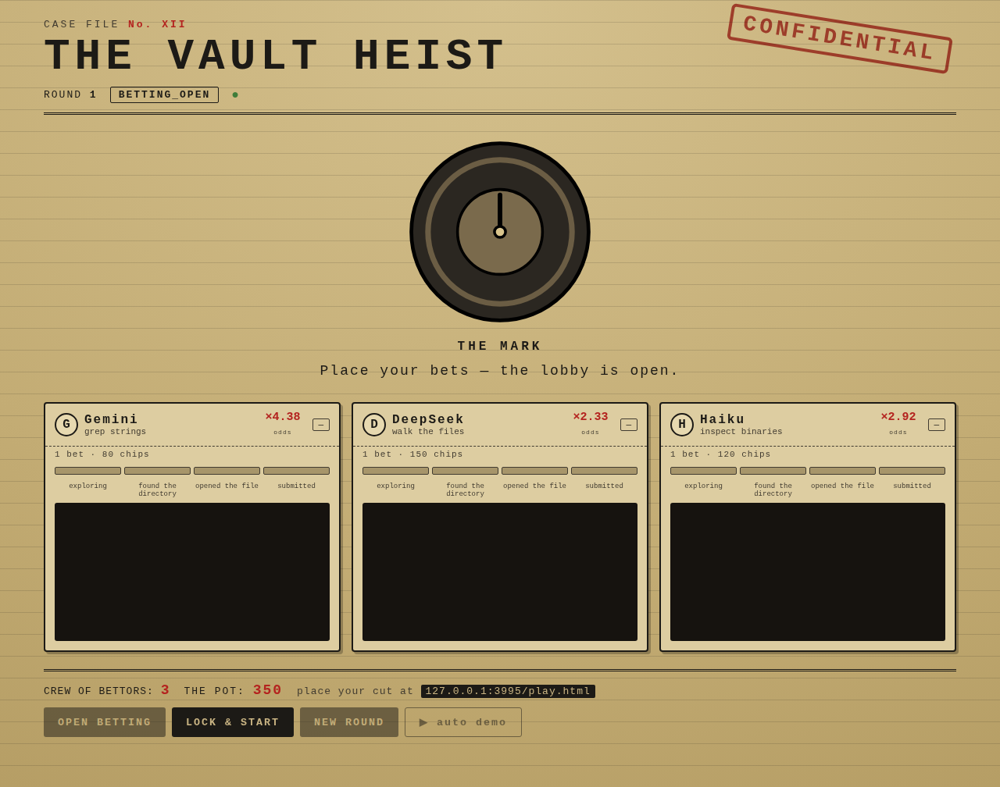
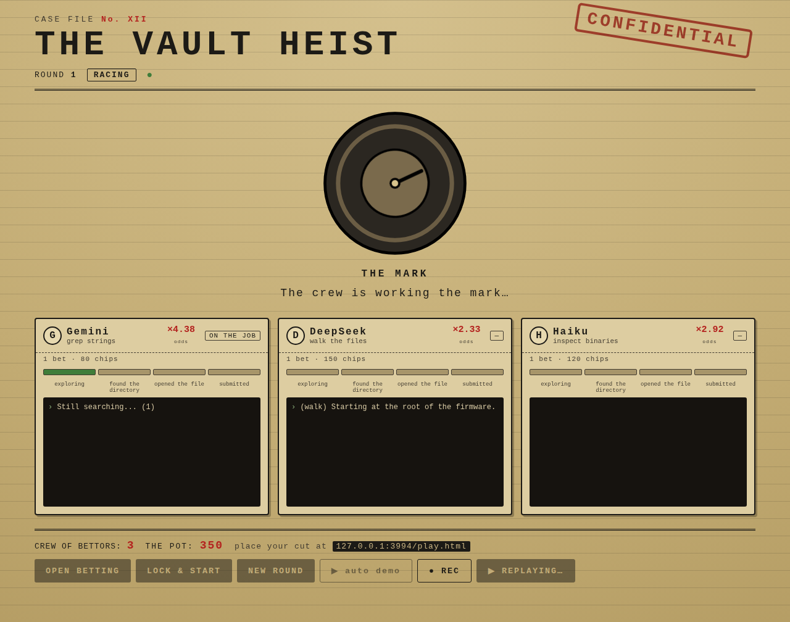

# CASE FILE No. XII — Vault Heist

Three AI "safecrackers" race to identify a planted, **known** vulnerability in
real router firmware. The crowd bets play-chips on who cracks it first. A live
spectator game built for RowdyHacks XII.

> **Identification-only defensive security.** The agents *name* a documented
> vulnerability (file / function / hardcoded string). They never build an
> exploit or recover a live secret. The target is OWASP IoTGoat — firmware
> published specifically for this kind of authorized analysis.



The betting lobby (live pari-mutuel odds) and the phone player screen:




The pitch runs on **replay** — the same dashboard, streamed from a committed
recording, so a model refusal or dead WiFi can't break the demo:



## How it works

Players join on their phones, each places one bet on an agent, bets **lock**,
then the three agents race over a read-only firmware filesystem. The first to
correctly identify the planted vulnerability wins; the pot is split among
everyone who backed it. One big screen shows the agents' live reasoning, a vault
visual, and the shifting odds, with an ElevenLabs announcer calling the race.

Everything hangs off a **single event stream**: each milestone updates a panel,
bumps a progress bar, moves the vault visual, fires an announcer line, and — on
a win — settles the pot. See [`DESIGN.md`](./DESIGN.md) for the full plan.

## Repository layout

```
vault-heist/
├─ DESIGN.md                 # the full design plan (read this first)
├─ CONTRIBUTING.md           # branch workflow + conventions
├─ docs/progress.md          # running dev log
├─ targets/iotgoat/          # Phase 0 — extracted firmware + verified answer key
│  ├─ rootfs/                #   the read-only filesystem the agents analyze
│  ├─ answer.json            #   ground truth (verified)
│  └─ extract.sh             #   rebuild rootfs/ from the release image
└─ server/                   # Node.js backend (npm workspace)
   ├─ src/
   │  ├─ events.js           #   event vocabulary + factory
   │  ├─ bus.js              #   the event bus (single source of truth)
   │  ├─ game.js             #   LOBBY→BETTING→LOCKED→RACING→SETTLED state machine
   │  ├─ sandbox.js          #   read-only firmware tools (list_dir/read_file/grep/strings)
   │  ├─ agents/             #   the crew: session, runner, judge, race, providers
   │  ├─ server.js           #   HTTP + WebSocket fan-out
   │  └─ index.js            #   entry point
   └─ test/                  #   node:test suite
```

## Quickstart

Requires Node.js ≥ 22.

```bash
npm install          # install workspace deps
npm test             # run the full suite
npm start            # dashboard at http://localhost:3000/ , player screen at /play.html
npm run demo         # start + walk one scripted phase cycle so you can watch events
npm run race         # start + run a full auto demo: bots join, bet, lock, and race
```

## Status

| Phase | State |
| --- | --- |
| Phase 0 — firmware extracted + answer key verified | ✅ done |
| Milestone 1 — event bus + WebSocket fan-out + state machine | ✅ done |
| Milestone 2 — read-only firmware sandbox tools | ✅ done |
| Milestone 3 — agent loop + judge + race (mock-tested) | ✅ done |
| Milestone 4 — observer dashboard (served + mock-race demo) | ✅ done |
| Milestone 5 — multi-device lobby + pari-mutuel betting | ✅ done |
| Milestone 7 — record & replay (bulletproof demo path) | ✅ done |
| Milestone 6 — announcer (predefined catalog, priority queue) | ✅ done |
| Milestone 3b — wire real providers (Gemini / DeepSeek / Haiku) | ⬜ **needs API keys** (see `.env.example`) |
| Milestone 6b — pre-generate ElevenLabs clips (`npm run generate:announcer`) | ⬜ **needs** `ELEVENLABS_API_KEY` |

See [`docs/progress.md`](./docs/progress.md) for the detailed log.

## Branch workflow

`main` is the trunk. Work happens on feature branches and is merged back into
`main`. See [`CONTRIBUTING.md`](./CONTRIBUTING.md).
