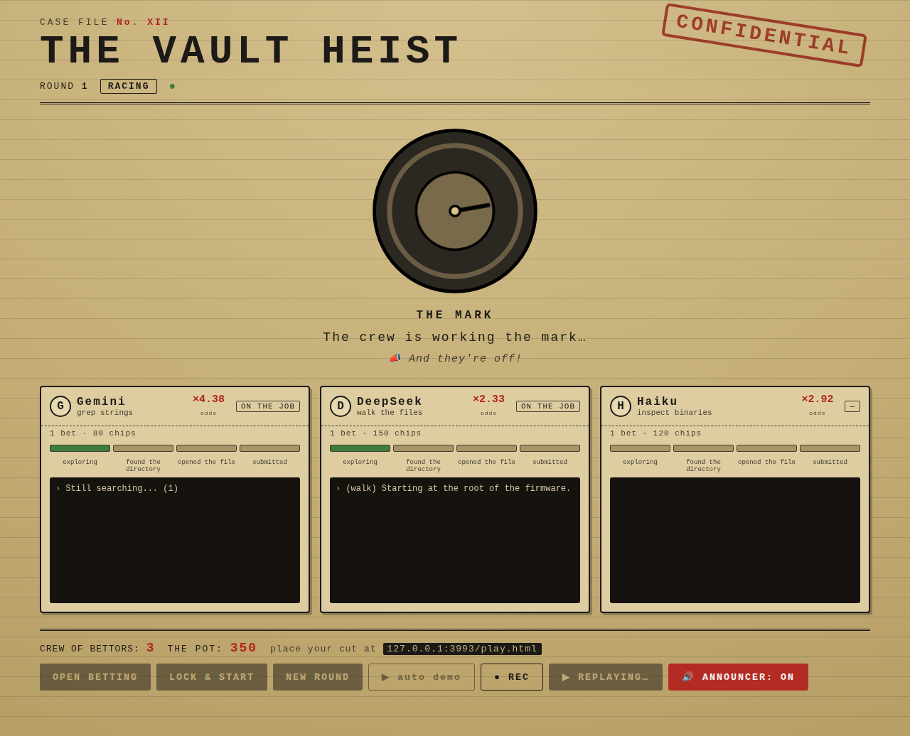
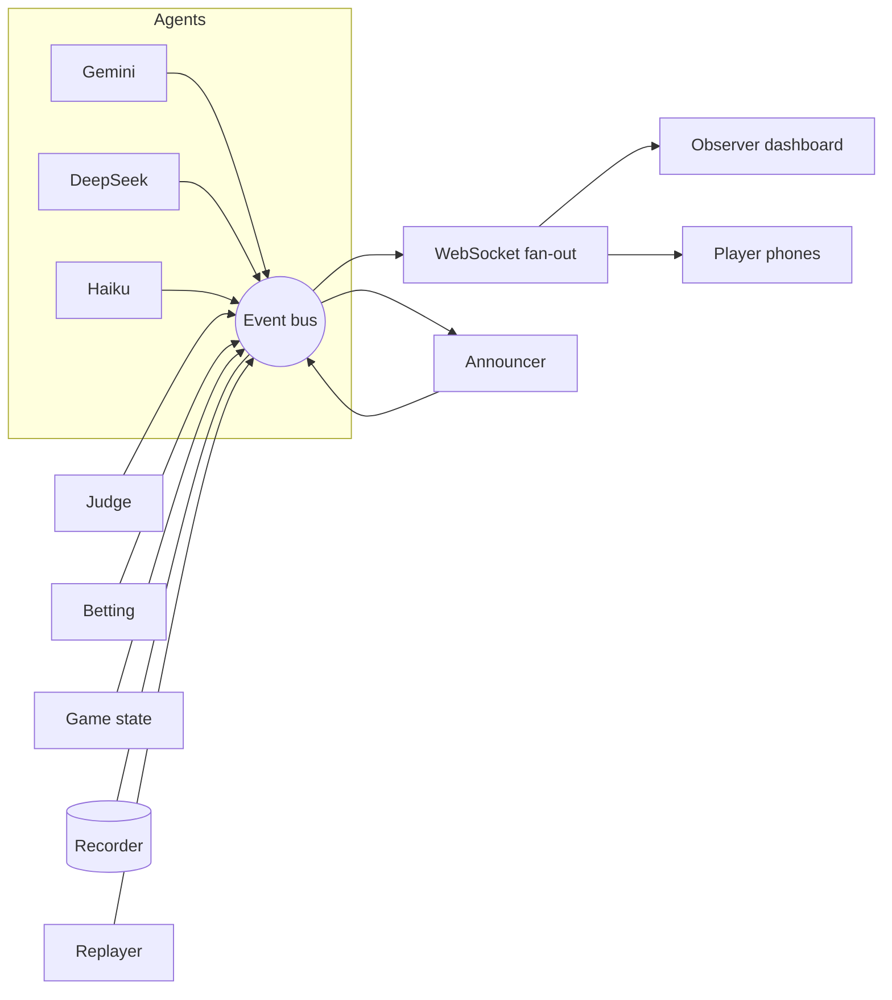

# CASE FILE No. XII — Vault Heist

Three AI "safecrackers" race to identify a planted, **known** vulnerability in
real router firmware. The crowd bets play-chips on who cracks it first, a vault
visual breaks open on the win, and a heist-crew announcer calls the race. Built
for RowdyHacks XII.

> **Identification-only defensive security.** The agents *name* a documented
> vulnerability (file / function / hardcoded string). They never build an exploit
> or recover a live secret. The target is OWASP IoTGoat — firmware published
> specifically for this kind of authorized analysis.


The betting lobby (live pari-mutuel odds), the phone player screen, and a replay
in progress with the announcer caption:




---

## Contents

- [Concept](#concept) · [How a round works](#how-a-round-works) · [Architecture](#architecture) · [Repository layout](#repository-layout)
- [Setup, step by step](#setup-step-by-step) · [Running it](#running-it) · [Demo day](docs/RUNBOOK.md)
- [Testing](#testing) · [Git workflow](#git-workflow) · [Status](#status) · [Troubleshooting](#troubleshooting)

---

## Concept

A live-spectator betting game. Players join on their phones, each places **one**
bet on an agent, the host **locks** betting, then the three agents race over a
read-only firmware filesystem using four tools (`list_dir`, `read_file`, `grep`,
`strings`) — no shell. The first to correctly identify the planted vulnerability
wins; the pot is split among everyone who backed it. One big screen shows the
agents' live reasoning, discrete milestone bars, a central vault that cracks open
on the win, the shifting odds, and an announcer calling milestones.

Everything hangs off a **single event stream**: each milestone updates a panel,
bumps a bar, moves the vault, fires an announcer line, and — on a win — settles
the pot. See [`DESIGN.md`](./DESIGN.md) for the full plan.

## How a round works

A round is a strict progression, driven by the game state machine:

```
LOBBY ─▶ BETTING_OPEN ─▶ BETS_LOCKED ─▶ RACING ─▶ SETTLED ─▶ (new round) ─▶ LOBBY
```

| Phase | What happens |
| --- | --- |
| `LOBBY` | Big screen shows the join link; players connect from phones. |
| `BETTING_OPEN` | Each player places one bet; odds move live as the pot fills. |
| `BETS_LOCKED` | Host locks betting; odds are final; "and they're off!" |
| `RACING` | The three agents run concurrently; milestones stream. |
| `SETTLED` | First correct submission wins; the pot pays out to its backers. |

## Architecture

One **event bus** is the single source of truth. Agents, the judge, the betting
engine, and the game machine all publish to it; the WebSocket layer fans every
event out to all clients; the announcer and recorder subscribe. Replays re-emit a
recording onto the same bus, so a replay is visually identical to a live run.



Node.js backend (`server/`), static vanilla frontend (`web/`), both pure ESM with
**no build step**. The server-side components are documented in
[`server/README.md`](./server/README.md).

## Repository layout

```
vault-heist/
├─ README.md                 # this guide
├─ DESIGN.md                 # the full design plan
├─ CONTRIBUTING.md           # branch workflow + conventions
├─ docs/
│  ├─ RUNBOOK.md             # demo-day run-of-show
│  ├─ progress.md            # dated dev log
│  └─ *.png                  # screenshots
├─ targets/iotgoat/          # Phase 0 — extracted firmware + verified answer key
│  ├─ rootfs/                #   the read-only filesystem the agents analyze
│  ├─ answer.json            #   ground truth (verified)
│  ├─ extract.sh             #   rebuild rootfs/ from the release image
│  └─ README.md              #   target details
├─ server/                   # Node.js backend (npm workspace) — see server/README.md
│  ├─ src/                   #   bus, game, sandbox, betting, recorder, replayer, agents/, announcer/
│  ├─ scripts/               #   record-demo.mjs, generate-announcer.mjs
│  └─ test/                  #   node:test suite
└─ web/                      # dashboard + player screen (static, served by the server)
   ├─ index.html, app.js     #   observer dashboard
   ├─ play.html, play.js     #   phone player screen
   ├─ reducer.js             #   pure render-state reducer (unit-tested)
   └─ announcer/             #   pre-generated voice clips + manifest.json
```

---

## Setup, step by step

### Prerequisites

- **Node.js ≥ 22** (`node --version`). Node 24 is fine.
- That's it for the demo — the firmware and announcer voices are committed.

### 1. Clone & install

```bash
git clone https://github.com/keswel/vault-heist.git
cd vault-heist
npm install            # installs the server + web workspaces
```

### 2. Firmware target (Phase 0) — already done

The extracted OWASP IoTGoat rootfs is committed at `targets/iotgoat/rootfs/`
(~13 MB, 1031 files) and the answer key `targets/iotgoat/answer.json` is verified
against it. **You don't need to do anything here to run the demo.**

To rebuild it from scratch (needs internet + `binwalk`/`squashfs-tools`):

```bash
cd targets/iotgoat && ./extract.sh      # downloads the release image, carves the SquashFS rootfs
```

Details and the three vulnerability "rounds" are in
[`targets/iotgoat/README.md`](./targets/iotgoat/README.md).

### 3. (Optional) Agent API keys — Milestone 3b

The agents currently run on **mock providers** (a scripted solver + wanderers),
so the full race works with **no keys**. Wiring the *real* models is Milestone 3b.
When you're ready, put keys in a `.env` file at the repo root (copy
`.env.example`):

```
GEMINI_API_KEY=...
DEEPSEEK_API_KEY=...
ANTHROPIC_API_KEY=...     # Haiku (optional crew member)
```

`.env` is auto-loaded (it's gitignored — never commit it). The provider adapters
in `server/src/agents/providers/{gemini,deepseek,haiku}.js` are stubs until
implemented; each documents its SDK mapping.

### 4. (Optional) Announcer voices — already generated

The 17 announcer lines are pre-generated with ElevenLabs and committed under
`web/announcer/` (with `manifest.json`). On startup you'll see
`announcer: 17 pre-generated clips loaded` and the big screen plays them — **no
API calls happen during the event**, so there's zero per-show TTS cost.

To regenerate (e.g. after editing the lines in
`server/src/announcer/catalog.js`), on a machine with internet:

```bash
# put ELEVENLABS_API_KEY + ELEVENLABS_VOICE_ID in .env, then:
cd server
npm run generate:announcer -- --dry-run   # previews the plan + your credit balance, generates nothing
npm run generate:announcer                 # synthesizes the 17 clips + manifest.json
cd .. && git add web/announcer && git commit -m "Regenerate announcer clips" && git push
```

The generator **checks your ElevenLabs balance first and refuses to run if it's
too low**, so it can't overrun your credits (the whole catalog is ~900 chars).
With no clips, the dashboard falls back to the browser's built-in speech.

---

## Running it

### Quick / dev

```bash
npm start        # dashboard at http://localhost:3000/ , player screen at /play.html
npm run demo     # start + walk one scripted phase cycle (just phase events)
npm run race     # start + a full auto demo: bots join, bet, lock, and race
npm test         # the full test suite
```

### The full multi-device demo

1. `npm start` on the machine driving the projector. Open `http://localhost:3000/`
   (the **observer dashboard**) on the big screen.
2. Players open `http://<that-machine-ip>:3000/play.html` on their phones (shown
   on the dashboard footer), enter an alias, and **join**.
3. Host clicks **OPEN BETTING**. Players pick a safecracker and place chips; the
   odds and pot update live on the big screen.
4. Host clicks **LOCK & START**. Bets freeze, the race runs, milestones stream,
   the announcer calls it, and the vault **cracks** on the win.
5. The pot pays out to the winner's backers; each player sees their result on
   their phone. Host clicks **NEW ROUND** to go again.

> Host controls can be gated with a `HOST_TOKEN` in `.env`; set it, then the
> dashboard needs `localStorage.hostToken` to match. Unset = open (fine for dev).

### Replay (the bulletproof demo path)

Click **▶ REPLAY** on the dashboard (or `POST /api/replay`). It streams the
committed `recordings/demo-clean.jsonl` through the same bus — identical to a
live run, with **no models and no network**. Use this on stage if WiFi or an API
is flaky. Record your own clean run with `npm run record:demo`.

### Announcer

Click **🔊 ANNOUNCER: OFF → ON** once (browsers require a click before audio).
The big screen then plays the pre-generated voice lines; a `📣` caption always
shows the current call even when muted.

---

## Testing

```bash
npm test                               # all workspaces (node:test)
npm test --workspace @vault-heist/server
npm test --workspace @vault-heist/web
```

The suite covers the event bus, the game state machine, the firmware sandbox
(against the real rootfs), the agent loop + judge + race, the betting math, the
recorder/replayer, the announcer, and the dashboard reducer.

## Git workflow

`main` is the trunk; work happens on feature branches and is merged back with
`--no-ff`. Tests must pass before merging. See [`CONTRIBUTING.md`](./CONTRIBUTING.md).

## Status

| Piece | State |
| --- | --- |
| Phase 0 — firmware extracted + answer key verified | ✅ |
| M1 event bus + state machine · M2 sandbox · M3 agent loop/judge/race | ✅ |
| M4 observer dashboard · M5 multi-device betting · M7 record & replay | ✅ |
| M6 announcer (predefined catalog + **generated ElevenLabs voices**) | ✅ |
| **M3b — wire real agent models** (Gemini / DeepSeek / Haiku) | ⬜ needs API keys + adapters |

The full interactive, narrated, bulletproof demo runs today on mock agents. The
only remaining work is swapping the mock agent providers for the real models.

## Troubleshooting

- **`ELEVENLABS_API_KEY is required` from the generator** → put it in `.env`
  (repo root or `server/`) or pass it inline; `.env` is auto-loaded on Node ≥ 20.12.
- **Generator `403 Host not in allowlist`** → you're on the restricted cloud
  sandbox; run the generator on a machine with normal internet.
- **No announcer audio** → click the **ANNOUNCER** toggle once (autoplay needs a
  gesture); with no `web/announcer/` clips it uses browser speech.
- **Port in use** → `PORT=4000 npm start`.
- **Firmware missing** → rebuild with `targets/iotgoat/extract.sh` (needs internet).

## Further reading

- [`DESIGN.md`](./DESIGN.md) — the full design plan and rationale.
- [`server/README.md`](./server/README.md) — backend modules, the command API, and the sandbox/agent/announcer internals.
- [`docs/RUNBOOK.md`](./docs/RUNBOOK.md) — the demo-day run-of-show.
- [`docs/progress.md`](./docs/progress.md) — the dated dev log.
